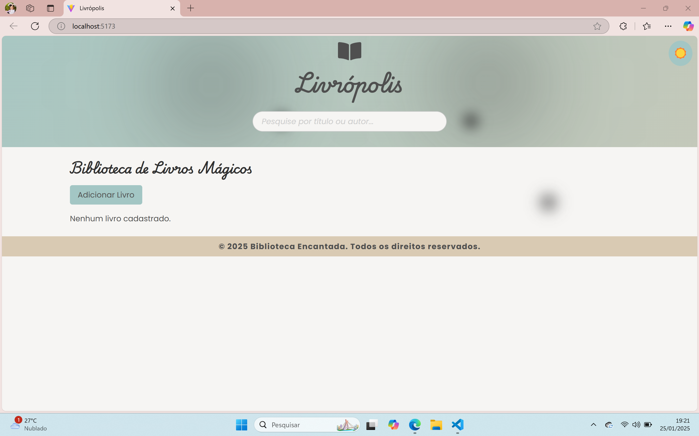
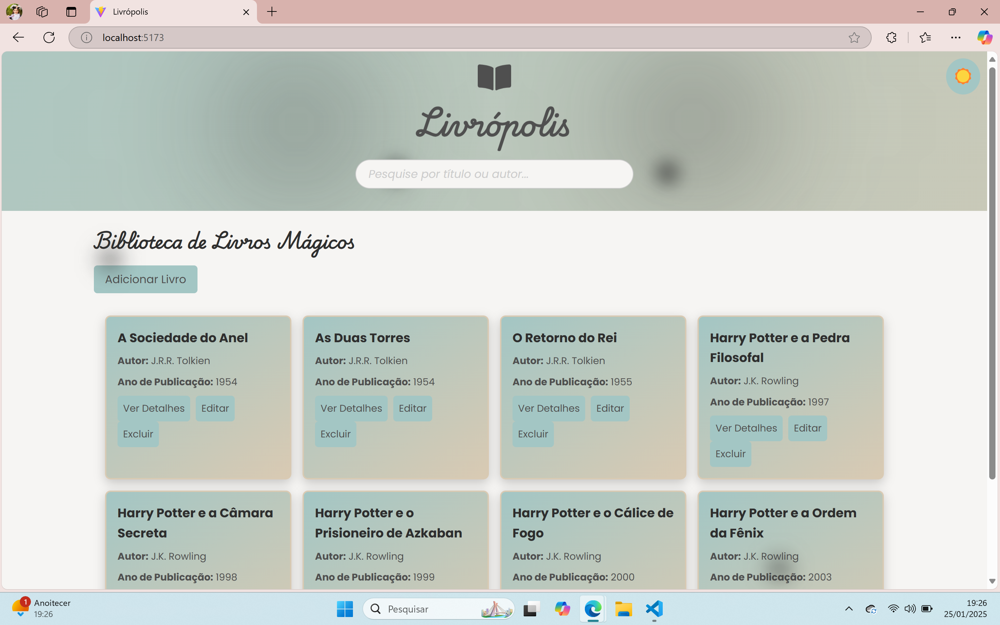
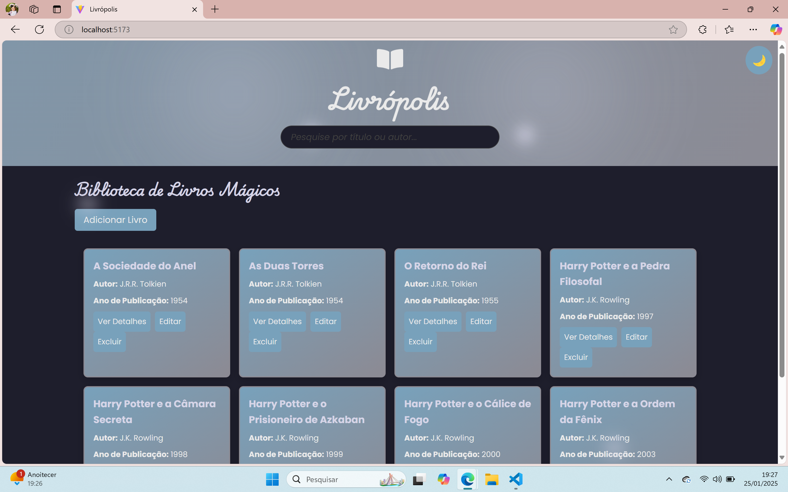
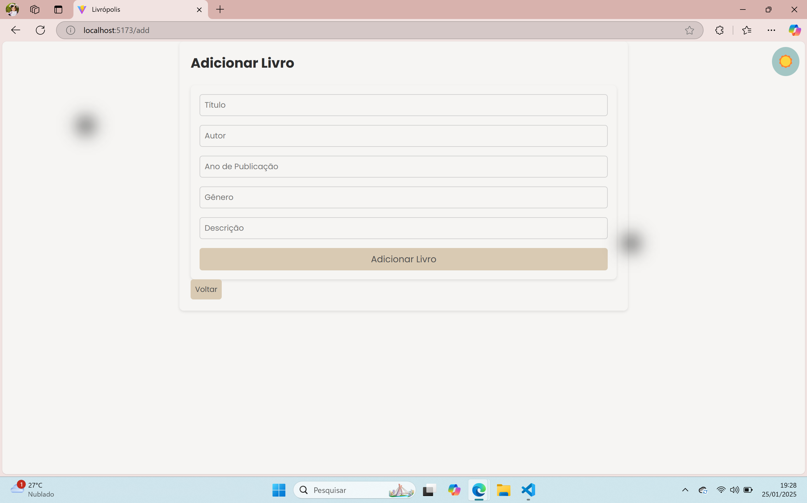
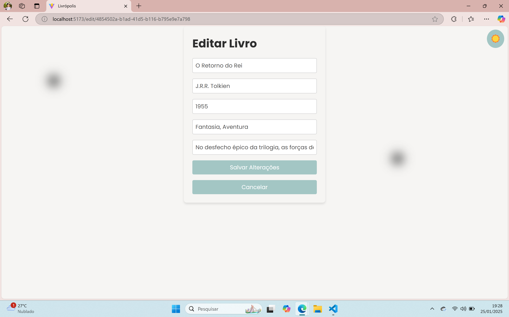
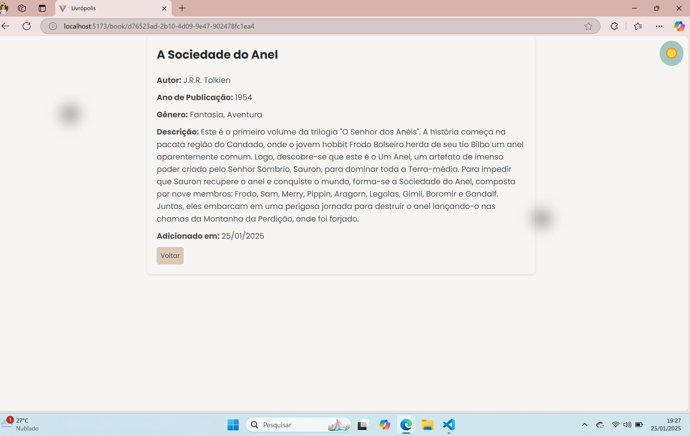

# Biblioteca Encantada - CRUD Livrópolis

## **Descrição do Projeto**
A **Biblioteca Encantada** é um sistema de gerenciamento de livros desenvolvido com React, TypeScript e Styled-Components. Este projeto oferece uma experiência mágica para os usuários, permitindo o cadastro, visualização, edição e exclusão de livros em uma interface estilizada que reflete o encanto de Livrópolis.

---
## Funcionalidades ✨

- **Adicionar Livros**: Cadastre novos livros com informações como título, autor, ano de publicação, gênero, e descrição. Cada livro recebe um identificador único (UUID) gerado automaticamente para garantir integridade.
- **Editar Livros**: Atualize as informações de livros já cadastrados, com validações para garantir a consistência dos dados.
- **Excluir Livros**: Remova livros do sistema com uma confirmação para evitar exclusões acidentais.
- **Pesquisar Livros**: Utilize a barra de pesquisa para localizar livros por título ou autor de forma dinâmica.
- **Modo Claro e Escuro**: Altere entre os temas claro e escuro para melhorar a experiência visual.
- **Persistência de Dados**: Os livros cadastrados são armazenados no `localStorage`, garantindo que os dados não sejam perdidos ao recarregar a página.

---

## Tecnologias Utilizadas 🛠️

- **React**: Biblioteca principal para construção da interface do usuário.
- **TypeScript**: Para maior segurança e tipagem no desenvolvimento.
- **Styled-Components**: Estilização utilizando componentes dinâmicos e tematização.
- **React Router**: Navegação entre páginas.
- **UUID**: Cada livro recebe um ID único utilizando a biblioteca `uuid` para garantir unicidade.

---

## **Estilização**

O projeto foi cuidadosamente estilizado com:
- **Cores suaves e elegantes** que remetem ao tema mágico.
- **Fontes estilizadas** para criar um ar encantado.
- **Animações mágicas**, como brilho nos botões e partículas flutuantes.
- **Design responsivo** para dispositivos móveis, tablets e desktops.

---
# Biblioteca Encantada - CRUD Livrópolis

## Home - Tema Claro sem livros

## Home - Tema Claro com livros

## Home - Tema Escuro

## Adicionar Livro

## Editar Livro

## Detalhes do Livro

